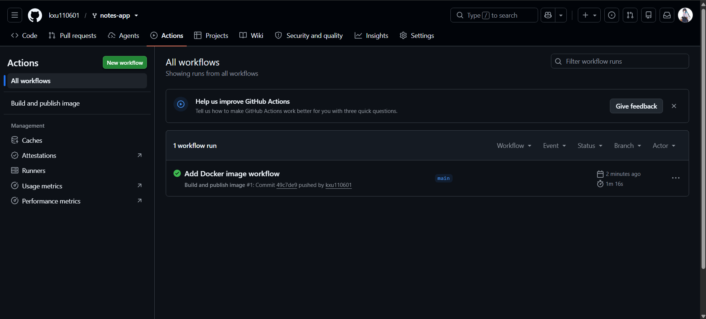
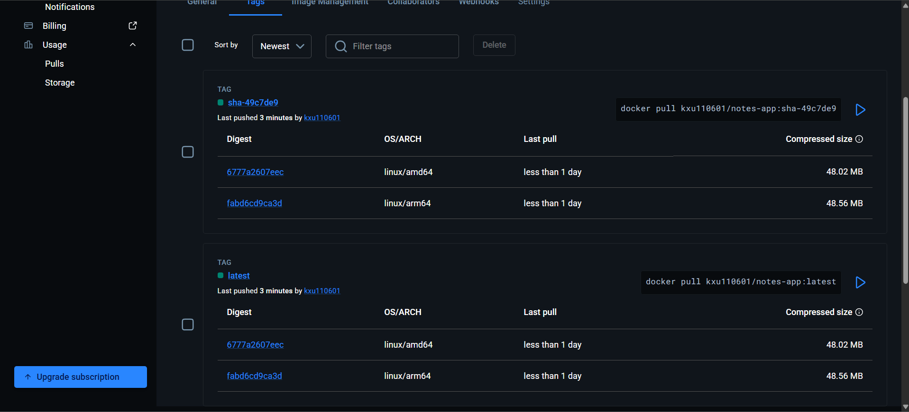
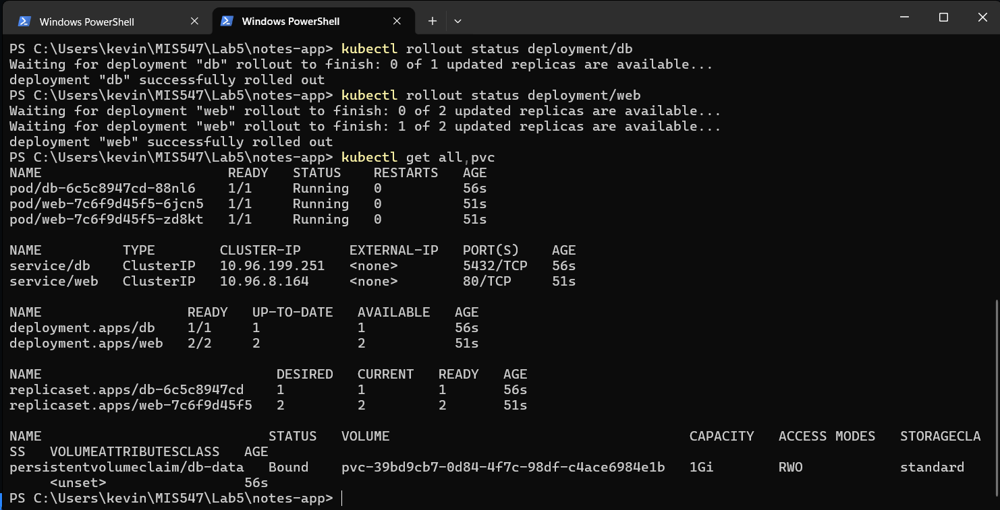
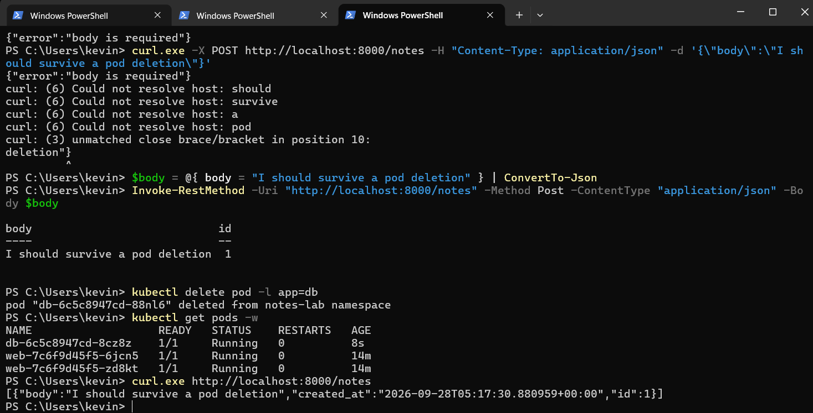
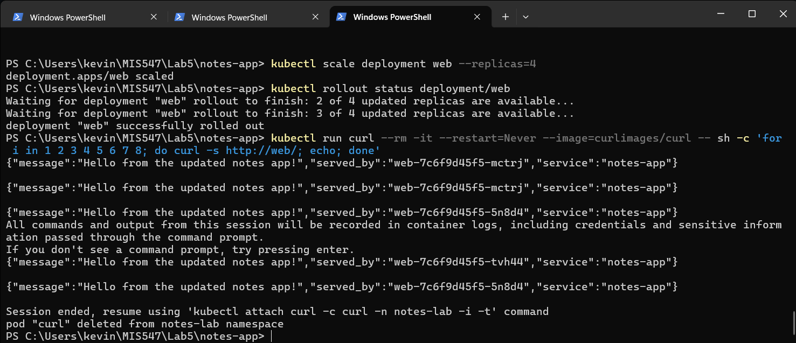
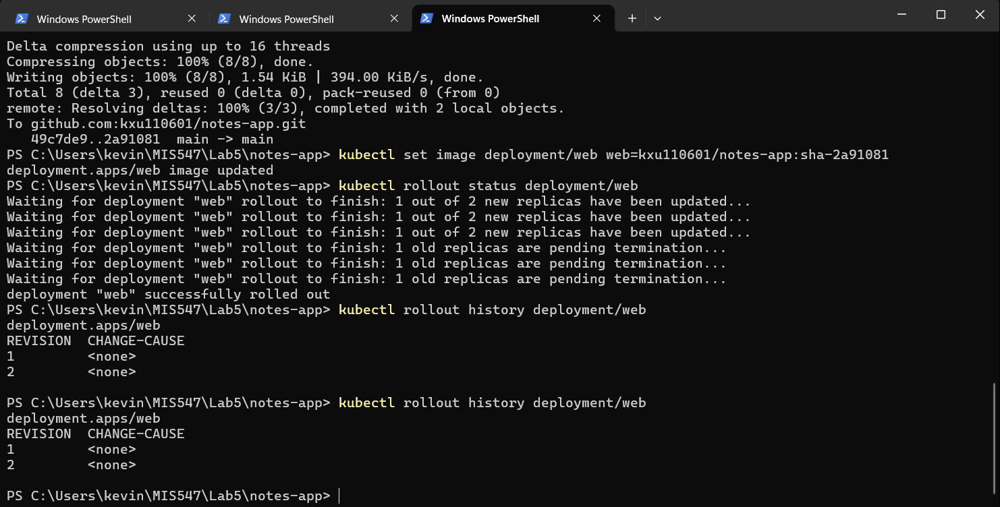

# Lab 5 Evidence

## GitHub Actions

Successful GitHub Actions workflow run:

## Docker Hub Multi-Architecture Image

Docker Hub image showing support for both `linux/amd64` and `linux/arm64`:

## Kubernetes Resources

Output of `kubectl get all,pvc` showing the database pod, two web pods, services, deployments, and bound persistent volume claim:

## Experiment 2 - Data Persistence

The note remained in the database after the database pod was deleted and recreated:

## Experiment 3 - Load Balancing

Requests were served by multiple web pods, as shown by the different `served_by` values:

## Rolling Update

Output of `kubectl rollout history deployment/web` after performing the rolling update:

